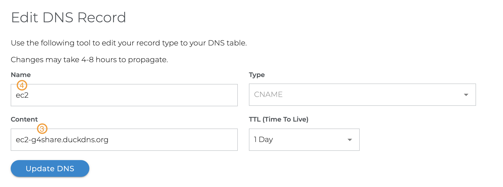
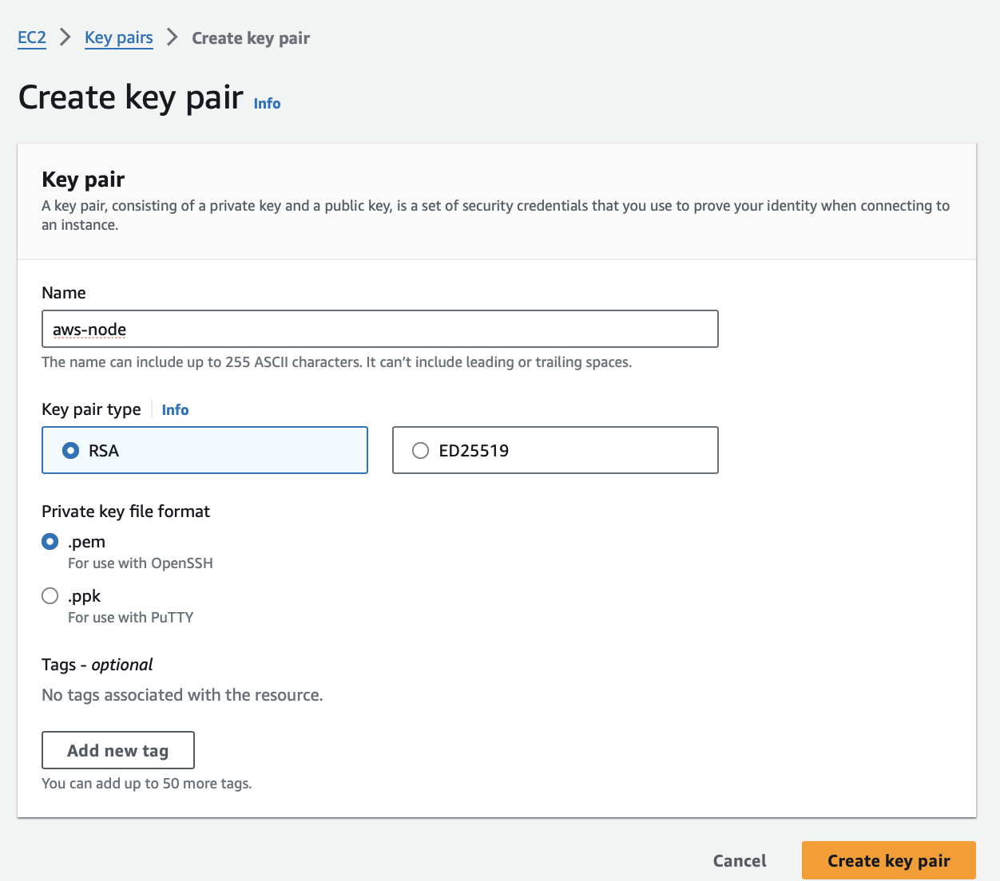

# AWS Lab

**Important** - _although most AWS services come with a cost, some are still offered for free during the first year. 
In this guide, we steer clear of paid services, for example, Elastic IP, to ensure a cost-free experience._

### Create and Configure your AWS account
- 00:00 - Intro: Disclaimer on Free Tier Account
- 00:40 - 1. Sign up for an AWS account
- 03:28 - 2. AWS Security Best Practices
- 04:00 - 3. Add Multi-factor Authentication (MFA) to the Root User account
- 05:20 - 4. Create an IAM User with an Administrator policy and MFA in order to provision resources.
- 09:35 - 5. Enable IAM users to view billing account info
- 11:07 - 6. Enabling billing alerts and Free Tier limit alerts
- 11:50 - 7. Create a billing alarm in order to be notified when exceeding $5.00 in your AWS account.


There is a great video on YouTube that explains all of these steps: https://youtu.be/FRQ9fE4fd5g
I've also downloaded it for offline viewing: [Setup and Secure AWS Free Tier Account](/media/Setup%20and%20Secure%20AWS%20Free%20Tier%20Account.mp4).

### Configure DynDns Name using **Duck DNS** Service

Accessing the EC2 virtual instance, whether through SSH or HTTPS, is much more convenient using a **domain** name compared to an IP address, especially since the Public IP changes after each restart. To obtain a Domain Name corresponding to the Dynamic IP, we will use the service [Duck DNS](https://www.duckdns.org).

- Open [Duck DNS](https://www.duckdns.org) Service and login using your Google Account.
- Note down
  - account (1)
  - token (2) - you will need them later.
  
  


- Enter your Duck DNS subdomain (3) and take note of it.
  


### Configure **CNAME** DNS Record; Optional, in case you have a purchased domain

- Add the CNAME DNS Records on your Domain Provider
  

### Variables Used Later

```console
# Duck DNS Token - (2)
DUCKNS_TOKEN=a98723a3-****-****-****-************

# Duck DNS Subdomain - (3)
DUCKNS_SUBDOMAIN=ec2-g4share  
```

- if you added a CNAME Record:
```console
# Domain - (4).yourdomain.com
DOMAIN=ec2.g4share.com
```

- otherwise:

```console
# Domain - (3).duckdns.org
DOMAIN=ec2-g4share.duckdns.org
```

### Create AWS Key Pair 
- Login to AWS using your non-root Account
- Create a new Key Pair - it will be auto downloaded
  


- To deploy an EC2 instance using Terraform, see [terraform/README.md](terraform/README.md).
- For manual deployment of an EC2 instance, develop Node.js remotely using AWS infrastructure, refer to the manual steps in [manual/README.md](manual/README.md).

## Ready for Challenges ?
