# Develop Node.js Remotely using AWS infrastructure

In this lab, we will use **Visual Studio Code Server** for remote development on **Node.js**. For this, we'll utilize 
an AWS virtual machine where we'll run everything required.

**Important** - _although most AWS services come with a cost, some are still offered for free during the first year. 
In this guide, we steer clear of paid services, for example, Elastic IP, to ensure a cost-free experience._

### Create and Configure your AWS account
- 00:00 - Intro: Disclaimer on Free Tier Account
- 00:40 - 1. Sign up for an AWS account
- 03:28 - 2. AWS Security Best Practices
- 04:00 - 3. Add Multi-factor Authentication (MFA) to the Root User account
- 05:20 - 4. Create an IAM User with an Administrator policy and MFA in order to provision resources.
- 09:35 - 5. Enable IAM users to view billing account info
- 11:07 - 6. Enabling billing alerts and Free Tier limit alerts
- 11:50 - 7. Create a billing alarm in order to be notified when exceeding $5.00 in your AWS account.


There is a great video on YouTube that explains all of these steps: https://youtu.be/FRQ9fE4fd5g
I've also downloaded it for offline viewing: [Setup and Secure AWS Free Tier Account](/media/Setup%20and%20Secure%20AWS%20Free%20Tier%20Account.mp4).

### Configure DynDns Name using **Duck DNS** Service

Accessing the EC2 virtual instance, whether through SSH or HTTPS, is much more convenient using a **domain** name compared to an IP address, especially since the Public IP changes after each restart. To obtain a Domain Name corresponding to the Dynamic IP, we will use the service [Duck DNS](https://www.duckdns.org).

- Open [Duck DNS](https://www.duckdns.org) Service and login using your Google Account.
- Memorize
  - account (1)
  - token (2) - you will need them later.
  
  


- Enter your Duck DNS subdomain (3) and memorize it.
  


### Configure **CNAME** DNS Record, Optional, in case you have a purchased domain

- Add the CNAME DNS Records on your Domain Provider
  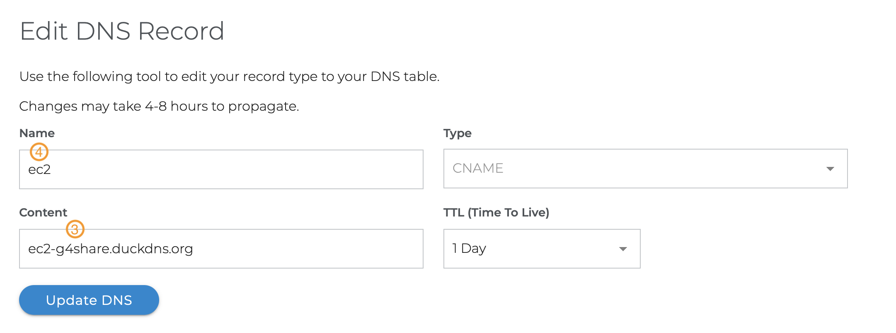

### Variables Used Later

```console
# Duck DNS Token - (2)
DUCKNS_TOKEN=a98723a3-****-****-****-************

# Duck DNS Subdomain - (3)
DUCKNS_SUBDOMAIN=ec2-g4share  
```

- if you added a CNAME Record:
```console
# Domain - (4).yourdomain.com
DOMAIN=ec2.g4share.com
```

- otherwise:

```console
# Domain - (3).duckdns.org
DOMAIN=ec2-g4share.duckdns.org
```

### Create AWS Key Pair 
- Login to AWS using your non-root Account
- Create a new Key Pair - it will be auto downloaded
  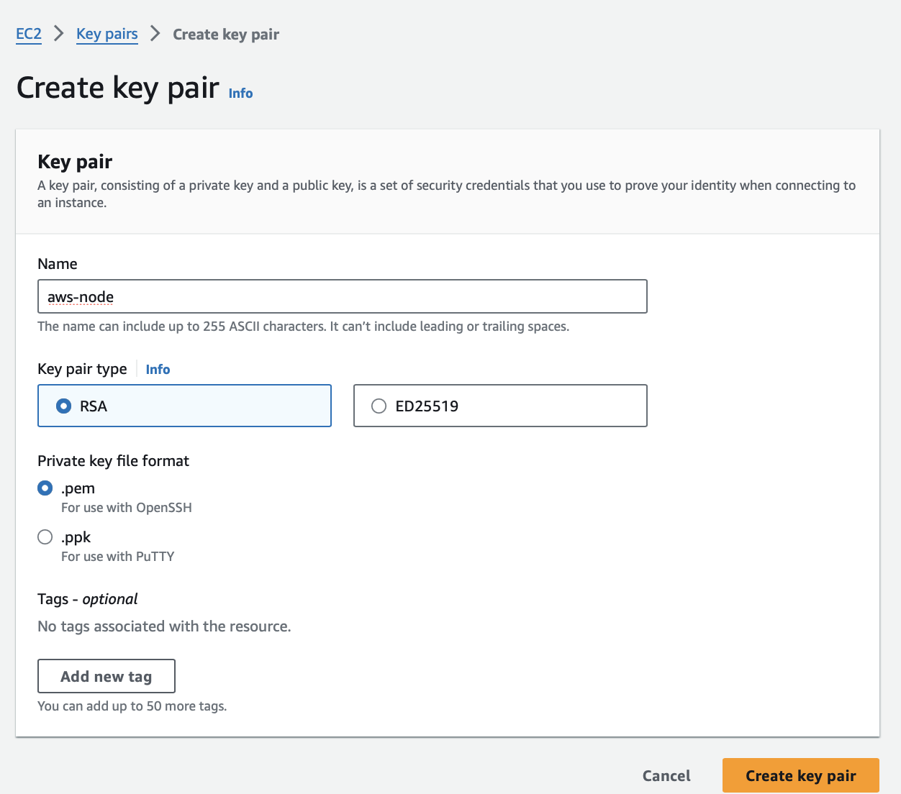

### Create AWS Security Groups (Open Ports)
- SSH - it's recommended to have a special security group for SSH port

  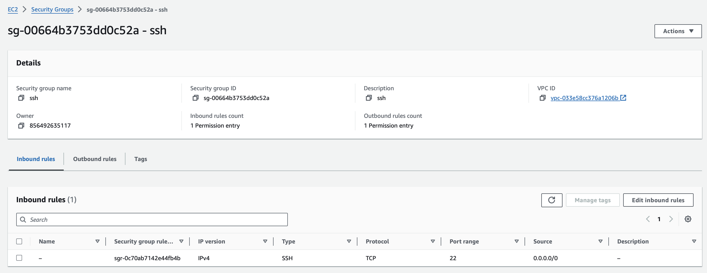


- HTTP,HTTPS

  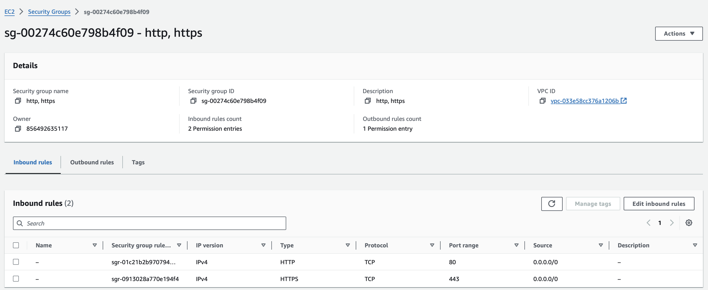
  
- Node

  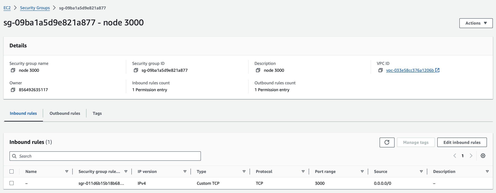

### Create EC2 Virtual Machine Instance

- Name & Machine Image

  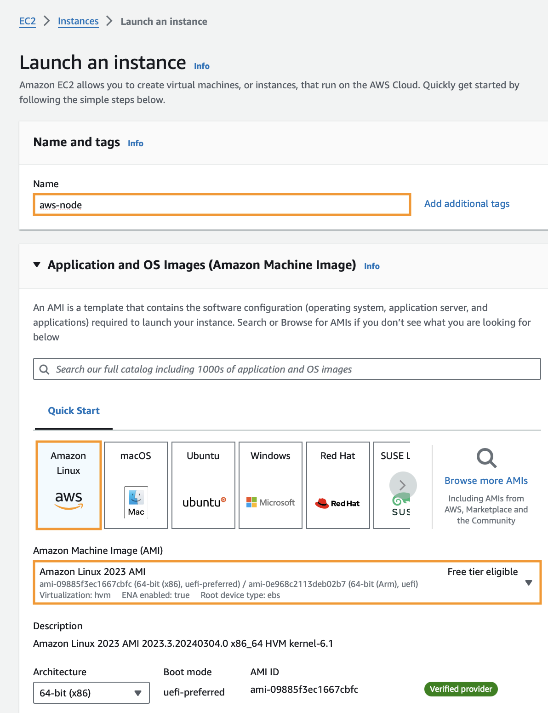


- Instance Type & Key Pair

  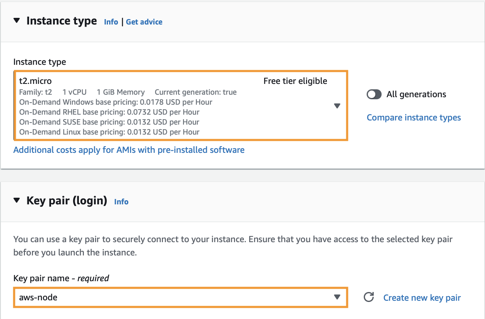


- Network Settings & Storage

  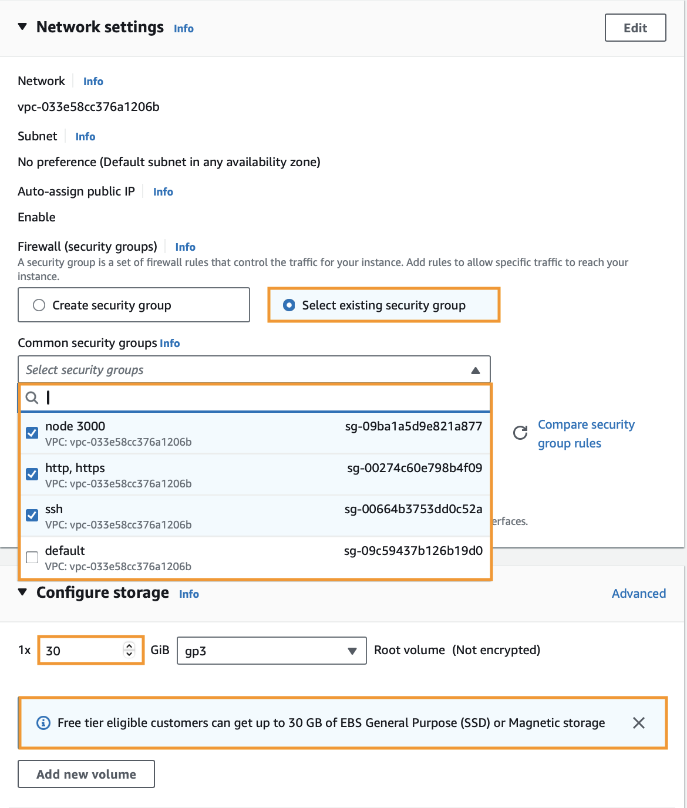


- Advanced Details / User Data

  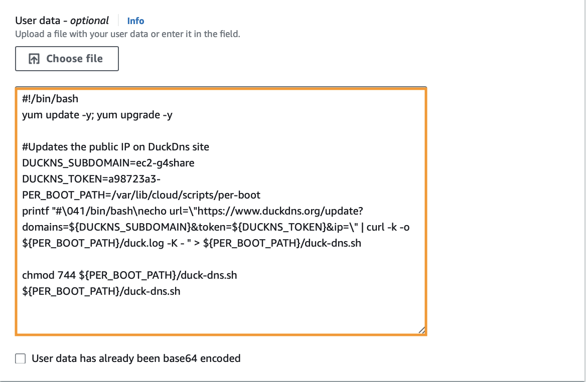

```console
#!/bin/bash
yum update -y; yum upgrade -y

#Updates the public IP on DuckDns site
DUCKNS_SUBDOMAIN=ec2-g4share
DUCKNS_TOKEN=a98723a3-****-****-****-************
PER_BOOT_PATH=/var/lib/cloud/scripts/per-boot
printf "#\041/bin/bash\necho url=\"https://www.duckdns.org/update?domains=${DUCKNS_SUBDOMAIN}&token=${DUCKNS_TOKEN}&ip=\" | curl -k -o ${PER_BOOT_PATH}/duck.log -K - " > ${PER_BOOT_PATH}/duck-dns.sh

chmod 744 ${PER_BOOT_PATH}/duck-dns.sh
${PER_BOOT_PATH}/duck-dns.sh
```

### Configure SSH Connection on your machine (Windows 10+, Linux, MacOs)

- Copy downloaded .pem file in **~/.ssh** folder

   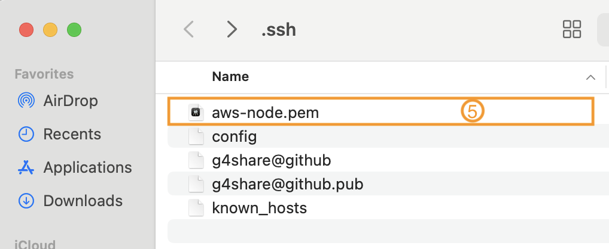

- Add a record in **~/.ssh/config** file

     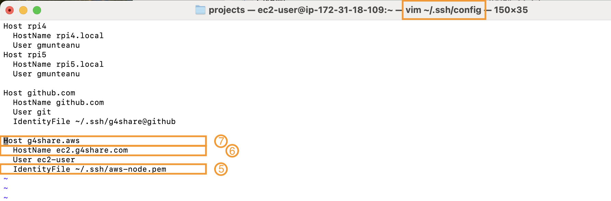

  - (5) - .pem file
  - (6) - DOMAIN _defined above_
  - (7) - short name


- Connect to AWS Instance from terminal **ssh g4share.aws**

     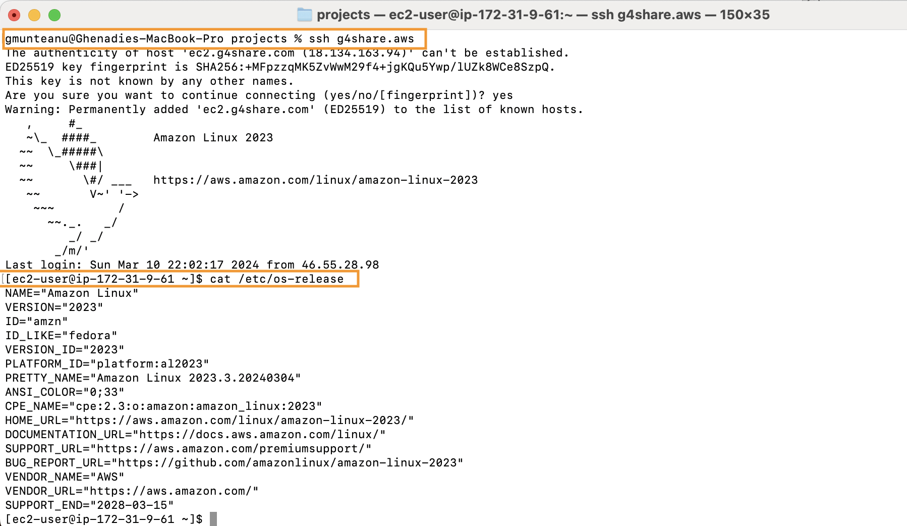

### Install required packages

- Open SSH Session to EC2 Instance - **ssh g4share.aws**
- Define required Variables _defined above_
```console
DUCKNS_SUBDOMAIN=ec2-g4share
DOMAIN=ec2.g4share.com
```
- Node.js
```console
sudo yum install nodejs -y
sudo npm install -g typescript
```
- Docker
```console
sudo yum install docker -y
sudo usermod -a -G docker ec2-user
newgrp docker
sudo systemctl enable docker.service
sudo systemctl start docker.service
```
- Docker Compose
```console
wget https://github.com/docker/compose/releases/latest/download/docker-compose-$(uname -s)-$(uname -m) 
sudo mv docker-compose-$(uname -s)-$(uname -m) /usr/local/bin/docker-compose
sudo chmod -v +x /usr/local/bin/docker-compose
```
- Git
```console
sudo yum install git -y
```
- Visual Studio Code Server
```console
curl -fsSL https://code-server.dev/install.sh | sh
sudo systemctl enable --now code-server@$USER
sudo systemctl start code-server@$USER
```
- Nginx, Certbot (free SSL Certificate)
```console
sudo yum install -y nginx certbot python3-certbot-nginx
```
- NGINX PreRequirements
```console
#put your email
LETSENCTYPT_EMAIL=g4share@gmail.com 

NGINX_SITES_PATH_AVAILABLE=/etc/nginx/sites-available
NGINX_SITES_PATH_ENABLED=/etc/nginx/sites-enabled

sudo mkdir -p ${NGINX_SITES_PATH_AVAILABLE}
sudo mkdir -p ${NGINX_SITES_PATH_ENABLED}
```
- Configure NGINX
```console
cat > ~/${DOMAIN}.conf << EOT
server {
    listen 80;
    listen [::]:80;

    server_name ${DOMAIN}        www.${DOMAIN};
        
    location / {
        proxy_pass "http://127.0.0.1:8080";
        proxy_set_header Host \$http_host;
        proxy_set_header X-Real-IP \$remote_addr;
        proxy_set_header X-Forwarded-For \$proxy_add_x_forwarded_for;
        proxy_set_header X-Forwarded-Proto \$scheme;
        proxy_set_header Upgrade \$http_upgrade;
        proxy_set_header Connection upgrade;
        proxy_set_header Accept-Encoding gzip;
    }
}
EOT

sudo mv ~/${DOMAIN}.conf ${NGINX_SITES_PATH_AVAILABLE}/${DOMAIN}.conf
sudo ln -s ${NGINX_SITES_PATH_AVAILABLE}/${DOMAIN}.conf ${NGINX_SITES_PATH_ENABLED}/${DOMAIN}.conf
```
- Download SSL Certificate, Restart NGINX
  - Edit **/etc/nginx/nginx.conf** file 
    - Remove all **server** section
    - Add **include /etc/nginx/sites-enabled/*.conf;** line in **http** section
    
    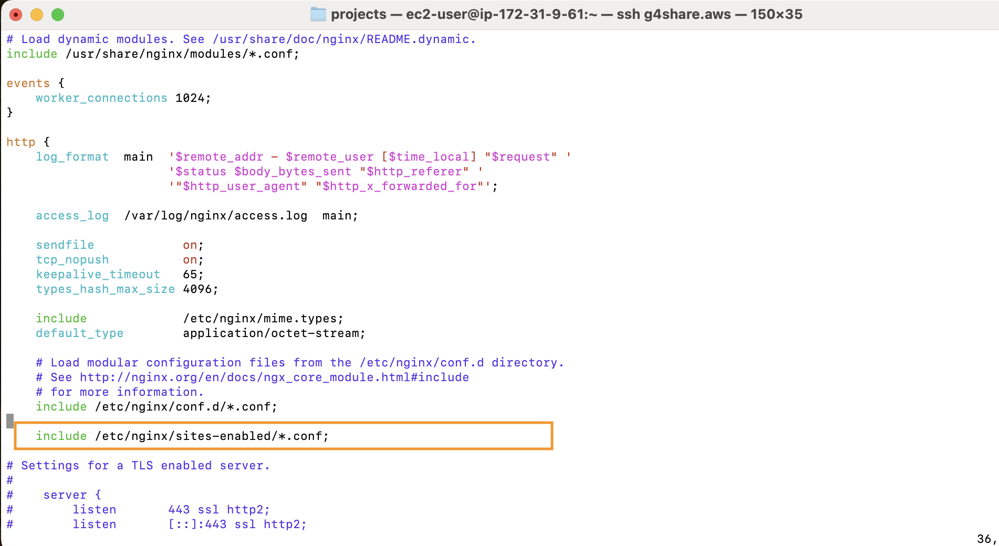

  - Add SSL Certificate for SSL connection
```console
certbot --non-interactive --redirect --agree-tos --nginx -d ${DOMAIN} -m ${LETSENCTYPT_EMAIL}
```
- Download Node.js HelloWorld application
  - git clone https://github.com/johnpapa/node-hello.git
- Open Visual Studio Code https://ec2.g4share.com/
- Open project

  


- Open Node.js application - http://ec2.g4share.com:3000
  

  
## Ready for Challenges ?
