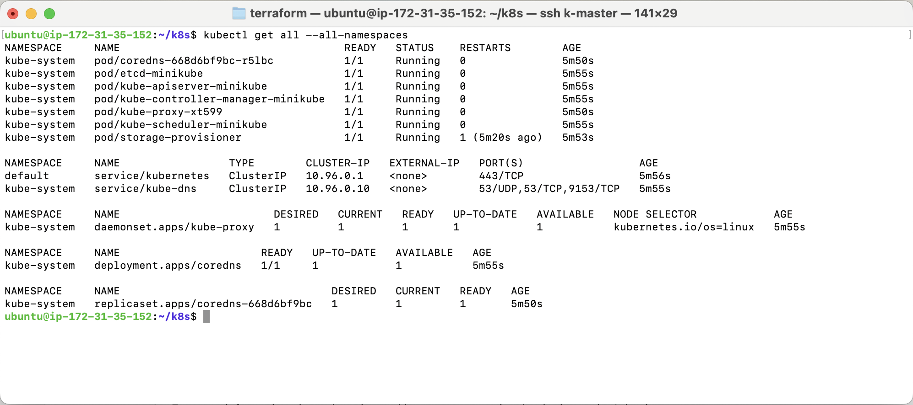

# Deploy EC2 Instance using Terraform

### EC2 Instance Parameters
Terraform is configured to create an AWS instance with the following parameters:

| Configuration    | Value                 | Description                            |
|------------------|-----------------------|----------------------------------------|
| Architecture     | 64-bit (Arm)          |                                        |
| Instance Type    | t4g.medium            | 2 vCPU, 4GiB Memory, 0.0371 USD / hour |
| Operating System | ami-0a7a4e87939439934 | Ubuntu Server 24.04 LTS                |

### Generate SSH Key Pair
1. Open a terminal on your local machine and execute the following command:
   ```console
   ssh-keygen -t ed25519 -f ~/.ssh/aws-us-east-1.pem
   ```
2. Secure the private key:
   ```console
   chmod 400 ~/.ssh/aws-us-east-1.pem
   ```

### Prerequisites
- Configure Duck DNS: [Configure Dynamic DNS Name using Duck DNS](../README.md#configure-dyndns-name-using-duck-dns-service)
- Create the ***aws_config.json*** file from ***aws_config-template.json*** and populate it with the required values:
    - tags.Owner
    - tags.Discipline
    - tags.Purpose
    - duckDns.subdomain.master
    - duckDns.token
- Create the ***aws_env.sh*** file from ***aws_env-template.sh*** and populate it with AWS IAM credentials -
 for an owned account: ***IAM / Security credentials / AWS IAM credentials / Access keys***; for a corporate account: ***Access keys***
    ```console
    export AWS_ACCESS_KEY_ID="???"
    export AWS_SECRET_ACCESS_KEY="???"
    export AWS_SESSION_TOKEN="???"
    ```

### Commands
1. Navigate to the Terraform directory:
   ```console
   cd terraform
   ```

2. Initialize the Terraform working directory by preparing it for further commands. This must be run before executing other commands like apply or plan, and whenever configuration or provider plugins change.
   ```console
   terraform init
   ```

3. Generate an execution plan, displaying what actions Terraform will take to match the desired infrastructure configuration. This step allows you to review changes before applying them.
   ```console
   source aws_env.sh && terraform plan
   ```
4. Applies the Terraform execution plan without interactive approval, automatically approving the changes.
   ```console 
   source aws_env.sh && terraform apply -auto-approve
   ```

# Install Kubernetes

### Connect to AWS Instance using SSH (local)
2. Add a new entry to the ***~/.ssh/config*** file:
   ```console
   Host k-master
   HostName kaws-master.duckdns.org
   User ubuntu
   IdentityFile ~/.ssh/aws-us-east-1.pem
   ```
3. Establish an SSH connection:
   ```console
   ssh k-master
   ```
### Install Kubernetes (remote)
1. Navigate to the Kubernetes setup directory:
   ```console
   cd k8s
   ```
2. Install Docker [Minikube Docker Driver Documentation](https://minikube.sigs.k8s.io/docs/drivers/docker/)
   ```console
   ./1-docker.sh
   ```
3. Install Minikube [Minikube Start Guide](https://minikube.sigs.k8s.io/docs/start/?arch=%2Flinux%2Farm64%2Fstable%2Fbinary+download)
   ```console
   ./2-minicube.sh
   ```
4. Install Kubectl [Install Kubectl](https://kubernetes.io/docs/tasks/tools/install-kubectl-linux/#install-using-native-package-management)
   ```console
   ./3-kubectl.sh
   ```
5. Verify the kubectl installation:
   ```console
   kubectl get all --all-namespaces
   ```
  

6. Configure ***vim*** for Kubernetes:
   ```console
   ./4-vim-kubernetes.sh
   ```

# Remove All Defined Resources (local)
   ```console
   source aws_env.sh && echo yes | terraform destroy
   ````